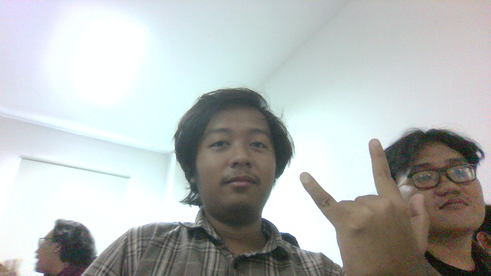

# Penjelasan Materi Praktikum 1: HTML Dasar

## 1. Tujuan Pembelajaran

Setelah menyelesaikan praktikum ini, mahasiswa diharapkan mampu:

1. Memahami struktur dasar dokumen HTML.
2. Mengenali dan menggunakan tag-tag dasar HTML.
3. Membuat dokumen HTML yang valid dan terstruktur.

---

## 2. Pengantar HTML

**HTML (HyperText Markup Language)** adalah bahasa markup yang digunakan untuk menyusun struktur dan konten halaman web. HTML terdiri dari serangkaian *tag* yang memberi instruksi kepada browser mengenai cara menampilkan informasi.

Pada praktikum ini, fokus materi mencakup:
- Struktur dokumen HTML
- Tag dan atribut
- Heading dan paragraf
- Hyperlink
- Gambar
- List (daftar)

---

## 3. Struktur Dasar Dokumen HTML

Setiap dokumen HTML memiliki struktur standar sebagai berikut:

```html
<!DOCTYPE html>
<html>
<head>
    <title>Judul Halaman</title>
</head>
<body>
    <!-- Konten yang ditampilkan di browser -->
</body>
</html>
```

### Penjelasan Bagian-bagian Utama

| Bagian              | Fungsi                                                                 |
|---------------------|------------------------------------------------------------------------|
| `<!DOCTYPE html>`   | Menyatakan bahwa dokumen menggunakan standar HTML5                     |
| `<html>`            | Elemen akar (root) dari seluruh dokumen                                |
| `<head>`            | Berisi metadata halaman (judul, CSS, script, dll.)                     |
| `<title>`           | Menentukan judul yang muncul di tab browser                            |
| `<body>`            | Berisi seluruh konten yang ditampilkan kepada pengguna                 |

---

## 4. Elemen, Tag, dan Atribut

### Elemen HTML
Elemen adalah komponen dasar pembentuk dokumen HTML. Umumnya terdiri dari:
- Tag pembuka
- Isi (content)
- Tag penutup

Contoh:
```html
<p>Ini adalah sebuah paragraf.</p>
```

### Tag HTML
Tag adalah penanda yang ditulis di dalam kurung siku (`<>`).  
Sebagian besar tag ditulis berpasangan (`<p>...</p>`), namun ada juga tag *self-closing* seperti `<br>`, `<hr>`, ``, dan `<input>`.

### Atribut HTML
Atribut memberikan informasi tambahan pada elemen dan ditulis di dalam tag pembuka.

Contoh:
```html
<a href="https://www.example.com">Kunjungi Website</a>

```

---

## 5. Tag Heading

HTML menyediakan enam tingkat heading:

```html
<h1>Heading Level 1</h1>
<h2>Heading Level 2</h2>
<h3>Heading Level 3</h3>
<h4>Heading Level 4</h4>
<h5>Heading Level 5</h5>
<h6>Heading Level 6</h6>
```

**Catatan penting:**  
Gunakan heading secara hierarkis. `<h1>` untuk judul utama, diikuti `<h2>`, `<h3>`, dan seterusnya. Penggunaan yang terstruktur membantu SEO dan aksesibilitas.

---

## 6. Paragraf, Line Break, dan Horizontal Rule

| Tag   | Fungsi                              | Contoh Penggunaan                  |
|-------|-------------------------------------|------------------------------------|
| `<p>` | Membuat paragraf                    | `<p>Teks paragraf</p>`             |
| `<br>`| Memaksa pindah baris (line break)   | `Teks baris 1<br>Teks baris 2`     |
| `<hr>`| Menampilkan garis horizontal        | `<hr>`                             |

---

## 7. Pemformatan Teks

Beberapa tag yang sering digunakan untuk memformat teks:

| Tag        | Keterangan                  |
|------------|-----------------------------|
| `<b>`      | Teks tebal (bold)           |
| `<strong>` | Teks penting (semantic bold)|
| `<i>`      | Teks miring (italic)        |
| `<em>`     | Teks ditegaskan (emphasis)  |
| `<mark>`   | Teks ditandai (highlight)   |
| `<small>`  | Teks lebih kecil            |
| `<del>`    | Teks dicoret (deleted)      |
| `<ins>`    | Teks sisipan (inserted)     |
| `<sub>`    | Subscript                   |
| `<sup>`    | Superscript                 |

Contoh:
```html
<p>Air ditulis sebagai H<sub>2</sub>O dan kuadrat sebagai x<sup>2</sup>.</p>
```

---

## 8. Hyperlink (Tag Anchor)

Tag `<a>` digunakan untuk membuat hyperlink. Atribut utama yang digunakan adalah `href`.

### Jenis Hyperlink

1. **Internal** (ke halaman dalam website yang sama)
   ```html
   <a href="halaman2.html">Halaman 2</a>
   ```

2. **Eksternal** (ke website lain)
   ```html
   <a href="https://www.google.com">Google</a>
   ```

3. **Anchor** (ke bagian tertentu dalam halaman yang sama)
   ```html
   <h2 id="materi">Materi HTML</h2>
   <a href="#materi">Menuju Materi HTML</a>
   ```

---

## 9. Tag Image

Gambar ditampilkan menggunakan tag `` (self-closing).

Atribut penting:

| Atribut  | Fungsi                                      |
|----------|---------------------------------------------|
| `src`    | Path atau URL file gambar                   |
| `alt`    | Teks alternatif (penting untuk aksesibilitas)|
| `width`  | Lebar gambar                                |
| `height` | Tinggi gambar                               |
| `title`  | Tooltip saat mouse diarahkan ke gambar      |

Contoh:
```html

```

**Catatan:** Jika path pada atribut `src` salah, gambar tidak akan tampil (broken image).

---

## 10. Tag List

### Unordered List (`<ul>`)
Digunakan untuk daftar tanpa urutan (bullet points).

```html
<ul>
    <li>HTML</li>
    <li>CSS</li>
    <li>JavaScript</li>
</ul>
```

### Ordered List (`<ol>`)
Digunakan untuk daftar berurutan (bernomor).

```html
<ol>
    <li>Mempelajari struktur HTML</li>
    <li>Mempelajari tag dan atribut</li>
    <li>Membuat halaman HTML</li>
</ol>
```

---

## 11. Komentar HTML

Komentar digunakan untuk memberikan catatan pada kode. Browser akan mengabaikan komentar.

```html
<!-- Ini adalah komentar HTML -->
```

Komentar sangat berguna untuk:
- Memberi penanda bagian kode
- Menonaktifkan kode sementara
- Memberikan penjelasan kepada developer lain

---

## 12. Ringkasan Praktik yang Harus Dilakukan

1. Membuat struktur dasar HTML.
2. Menambahkan heading dan paragraf.
3. Melakukan pemformatan teks.
4. Menyisipkan gambar.
5. Membuat hyperlink internal dan eksternal.
6. Membuat unordered list dan ordered list.
7. Menambahkan komentar.
8. Menggabungkan semua elemen menjadi halaman **Profil Mahasiswa**.

---

## 13. Jawaban Pertanyaan Teori

1. **Fungsi `<!DOCTYPE html>`**  
   Menyatakan bahwa dokumen menggunakan standar HTML5 dan membantu browser merender halaman dengan benar.

2. **Perbedaan Tag, Elemen, dan Atribut**  
   - **Tag**: penanda (`<p>`, `</p>`)  
   - **Elemen**: kombinasi tag + isi  
   - **Atribut**: informasi tambahan pada tag (`href`, `src`, `alt`)

3. **Perbedaan `<p>` dan `<br>`**  
   - `<p>`: membuat paragraf (ada jarak atas-bawah)  
   - `<br>`: hanya memaksa pindah baris tanpa membuat paragraf baru

4. **Fungsi atribut `href`**  
   Menentukan tujuan (URL) dari hyperlink.

5. **Perbedaan hyperlink internal vs eksternal**  
   - Internal: mengarah ke file dalam website yang sama  
   - Eksternal: mengarah ke website di luar domain

6. **Fungsi `src` dan `alt` pada ``**  
   - `src`: lokasi file gambar  
   - `alt`: teks alternatif jika gambar gagal dimuat + untuk aksesibilitas

7. **Perbedaan `<ul>` dan `<ol>`**  
   - `<ul>`: daftar tidak berurutan (bullet)  
   - `<ol>`: daftar berurutan (nomor)

8. **Jika path `src` salah**  
   Gambar tidak tampil (muncul ikon broken image).

9. **Mengapa heading harus terstruktur**  
   Membantu struktur dokumen, SEO, dan aksesibilitas (screen reader).

10. **Fungsi komentar**  
    Memberikan catatan pada kode tanpa ditampilkan di browser.

---

## 14. Struktur Output yang Diharapkan

```
Lab1Web/
├── index.html
├── halaman2.html
├── images/
│   └── profil.jpg
└── README.md
```

---

**Catatan:**  
Praktikum 1 hanya berfokus pada HTML Dasar. Materi CSS dan JavaScript akan dipelajari pada pertemuan berikutnya sesuai Rencana Pembelajaran Semester (RPS).
```

---

File sudah dibuat: **`Penjelasan_HTML_Dasar.md`**  
Langsung bisa didownload.
